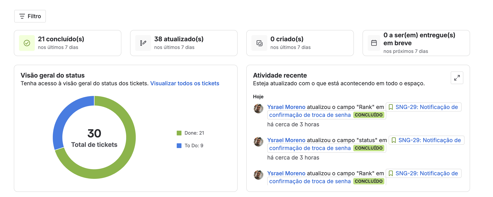
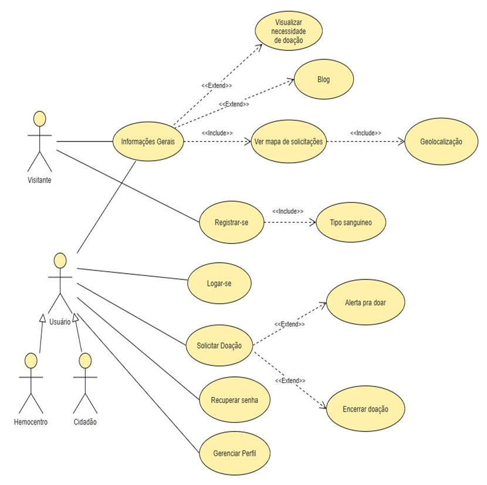

# 🩸 Sangue Solidário - Frontend

> **Mudando a vida através da solidariedade**

Integrantes

Ysrael Moreno
Caio Cesar Martins de Lima

Frontend da plataforma Sangue Solidário desenvolvido com Next.js 15, conectando doadores de sangue com pessoas e instituições que precisam de doações.

## 📋 Índice

- [Sobre o Projeto](#-sobre-o-projeto)
- [Tecnologias](#-tecnologias)
- [Pré-requisitos](#-pré-requisitos)
- [Instalação e Execução](#-instalação-e-execução)
- [Configuração](#-configuração)
- [Arquitetura](#-arquitetura)
- [Estrutura do Projeto](#-estrutura-do-projeto)
- [Comunicação com APIs](#-comunicação-com-apis)
- [Funcionalidades](#-funcionalidades)
- [Desenvolvimento](#-desenvolvimento)
- [Deploy](#-deploy)
- [Contribuição](#-contribuição)

## 🎯 Sobre o Projeto

A plataforma SANGUE SOLIDÁRIO visa facilitar a doação de sangue promovendo conscientização sobre o tema, conectando doadores a pessoas ou hemocentros necessitados e vice-versa através de um website completo.

O **Sangue Solidário Frontend** é uma aplicação web moderna desenvolvida com **Next.js 15** que facilita a conexão entre doadores de sangue e instituições de saúde. A plataforma permite:

- 🔐 **Autenticação completa** para doadores e instituições
- 🗺️ **Visualização de solicitações em mapa interativo**
- 📋 **Criação e gerenciamento de solicitações de doação**
- 📊 **Dashboard com estatísticas**
- 📝 **Blog com informações sobre doação**
- 💬 **Sistema de contato**

### 🎨 Principais Características

- ⚡ **Alto desempenho** com Next.js 15 e Turbopack
- 🎨 **UI moderna** com Bootstrap 5 e Material-UI
- 🗺️ **Mapas interativos** com Leaflet e Google Maps
- 🔄 **SSR e SSG** para SEO e performance
- 📱 **Totalmente responsivo**
- 🚩 **Feature Flags** para controle dinâmico de funcionalidades
- 🔒 **Autenticação com JWT**
- 📝 **Validação de formulários** com Formik e Yup

## 🛠️ Tecnologias

### Core

- **Next.js 15.3.1** - Framework React com App Router
- **React 19** - Biblioteca de interface de usuário
- **TypeScript 5** - Tipagem estática
- **Turbopack** - Bundler ultrarrápido

### UI & Styling

- **Bootstrap 5** - Framework CSS
- **SCSS** - Pré-processador CSS
- **Material-UI (@mui)** - Componentes UI
- **Bootstrap Icons** - Biblioteca de ícones
- **React Icons** - Ícones adicionais

### Maps & Geolocation

- **Leaflet** - Mapa interativo
- **React Leaflet** - Integração Leaflet com React
- **@vis.gl/react-google-maps** - Integração Google Maps

### HTTP & Communication

- **Fetch API** - API nativa para requisições

### Security

- **sanitize-html** - Sanitização de HTML
- **JWT** - Autenticação com tokens

### Utilities

- **Lucide React** - Ícones modernos
- **React Swipeable** - Gestos touch

## 📋 Pré-requisitos

Antes de começar, certifique-se de ter instalado:

- **Node.js** (versão 18 ou superior)
- **npm**
- **Git**

## 🚀 Instalação e Execução

### 1. Clone o Repositório

```bash
git clone https://github.com/c3ny/sangue-solidario-nextjs
cd sangue-solidario-nextjs
```

### 2. Instale as Dependências

```bash
npm install
```

### 3. Configure as Variáveis de Ambiente

Crie um arquivo `.env.local` na raiz do projeto:

```env
# URLs dos Microserviços
NEXT_PUBLIC_USERS_SERVICE_URL=http://localhost:3002
NEXT_PUBLIC_DONATION_SERVICE_URL=http://localhost:8080
NEXT_PUBLIC_BLOOD_STOCK_SERVICE_URL=http://localhost:8081

# URLs para Server Actions (sem http://)
USERS_SERVICE_URL=localhost:3002
DONATION_SERVICE_URL=localhost:8080
BLOOD_STOCK_SERVICE_URL=localhost:8081

# Feature Flags
NEXT_PUBLIC_FEATURE_BLOG=true
NEXT_PUBLIC_FEATURE_ABOUT_US=true

# Ambiente
NODE_ENV=development
```

### 4. Execute o Projeto

```bash
# Desenvolvimento
npm run dev

# Build para produção
npm run build

# Iniciar produção
npm start

# Linting
npm run lint
```

### 5. Acesse a Aplicação

Abra seu navegador em: **http://localhost:3000**

## ⚙️ Configuração

### Microserviços

A aplicação se comunica com três microserviços principais:

| Serviço             | Porta | Descrição                                |
| ------------------- | ----- | ---------------------------------------- |
| Users Service       | 3002  | Autenticação e gerenciamento de usuários |
| Donation Service    | 8080  | Solicitações e gestão de doações         |
| Blood Stock Service | 8081  | Controle de estoque de sangue            |

### URLs de Configuração

O sistema suporta URLs diferentes para **server-side** e **client-side**:

#### Client-Side (Componentes de Cliente)

```env
NEXT_PUBLIC_USERS_SERVICE_URL=http://localhost:3002
NEXT_PUBLIC_DONATION_SERVICE_URL=http://localhost:8080
```

#### Server-Side (Server Actions)

```env
USERS_SERVICE_URL=localhost:3002
DONATION_SERVICE_URL=localhost:8080
```

### Feature Flags

Controle dinamicamente as funcionalidades:

```env
# Habilitar/desabilitar blog
NEXT_PUBLIC_FEATURE_BLOG=true

# Habilitar/desabilitar seção sobre nós
NEXT_PUBLIC_FEATURE_ABOUT_US=true
```

## 🏗️ Arquitetura

### Arquitetura de Componentes

```
┌─────────────────────────────────────────────────────┐
│                  Next.js App Router                 │
│                 (App Directory)                     │
├─────────────────────────────────────────────────────┤
│                                                     │
│  ┌─────────────────────────────────────────────┐    │
│  │          Layout Components                  │    │
│  │  Header, Footer, Navbar, AuthWrapper       │     │
│  └─────────────────────────────────────────────┘    │
│                      ↓                              │
│  ┌─────────────────────────────────────────────┐    │
│  │          Feature Components                 │    │
│  │  Home, Blog, Contact, Solicitations        │     │
│  └─────────────────────────────────────────────┘    │
│                      ↓                              │
│  ┌─────────────────────────────────────────────┐    │
│  │          UI Components                      │    │
│  │  Button, Card, Input, Map, etc.            │     │
│  └─────────────────────────────────────────────┘    │
│                      ↓                              │
│  ┌─────────────────────────────────────────────┐    │
│  │          Services Layer                     │    │
│  │  API Service, Form Validation               │    │
│  └─────────────────────────────────────────────┘    │
│                      ↓                              │
│  ┌─────────────────────────────────────────────┐    │
│  │         Microservices APIs                  │    │
│  │  Users, Donations, Blood Stock              │    │
│  └─────────────────────────────────────────────┘    │
└─────────────────────────────────────────────────────┘
```

### Padrões Arquiteturais

#### 1. Feature-Based Architecture

Cada funcionalidade é isolada em sua própria pasta:

```
src/features/
├── Blog/
│   ├── components/
│   ├── interfaces/
│   └── services/
├── Contact/
│   ├── interfaces/
│   └── services/
└── Home/
    └── components/
```

#### 2. Componente Reutilizáveis

Componentes genéricos na pasta `/components`:

```
src/components/
├── Button/
├── Card/
├── Input/
├── Map/
└── ...
```

#### 3. Server Actions

Ações do servidor para mutações de dados:

```
src/actions/
├── auth/
└── donations/
```

## 📁 Estrutura do Projeto

```
sangue-solidario-nextjs/
├── src/
│   ├── actions/              # Server Actions
│   │   ├── auth/
│   │   └── donations/
│   ├── app/                  # Next.js App Router
│   │   ├── (auth)/          # Rotas de autenticação
│   │   │   ├── login/
│   │   │   ├── cadastro/
│   │   │   └── recuperar-senha/
│   │   └── (main)/          # Rotas principais
│   │       ├── blog/
│   │       ├── contato/
│   │       ├── solicitacoes/
│   │       ├── perfil/
│   │       └── ...
│   ├── components/          # Componentes reutilizáveis
│   │   ├── Button/
│   │   ├── Card/
│   │   ├── Input/
│   │   ├── Map/
│   │   └── ...
│   ├── features/           # Funcionalidades
│   │   ├── Blog/
│   │   ├── Contact/
│   │   ├── Home/
│   │   └── Solicitations/
│   ├── contexts/          # React Contexts
│   │   └── FeatureFlagsContext.tsx
│   ├── hooks/             # Custom Hooks
│   │   ├── useGeolocation.tsx
│   │   └── useTokenExpiration.ts
│   ├── interfaces/        # TypeScript Interfaces
│   │   ├── User.interface.ts
│   │   └── Components.interface.ts
│   ├── service/           # Services e configurações
│   │   ├── api/
│   │   └── featureFlags/
│   ├── config/            # Configurações
│   │   └── microservices.ts
│   ├── lib/               # Utilitários
│   │   ├── api.ts
│   │   └── types.ts
│   └── utils/             # Funções auxiliares
│       ├── auth.ts
│       ├── masks.ts
│       └── jwt.ts
├── public/                # Assets estáticos
├── .env.local            # Variáveis de ambiente
├── next.config.ts        # Configuração Next.js
├── tsconfig.json         # Configuração TypeScript
└── package.json          # Dependências
```

## 🌐 Comunicação com APIs

### API Service Architecture

A comunicação com os microserviços é gerenciada através do **APIService** centralizado:

#### Estrutura de Serviços

```typescript
// src/service/api/api.ts
export class APIService {
  // Métodos para comunicação com APIs
  async get<T>(url: string): Promise<IAPIResponse<T>>;
  async post<T>(url: string, data: any): Promise<IAPIResponse<T>>;
  async put<T>(url: string, data: any): Promise<IAPIResponse<T>>;
  async delete<T>(url: string): Promise<IAPIResponse<T>>;
}
```

#### Resposta Padrão

Todos os serviços retornam `IAPIResponse<T>`:

```typescript
interface IAPIResponse<T> {
  success: boolean;
  message: string;
  data?: T;
}
```

### Configuração de Microserviços

O arquivo `src/config/microservices.ts` gerencia as URLs dos serviços:

```typescript
export function getMicroserviceUrls(): IMicroserviceConfig {
  return {
    users: {
      server: "http://localhost:3002",
      client: "http://localhost:3002",
    },
    donation: {
      server: "http://localhost:8080",
      client: "http://localhost:8080",
    },
    bloodStock: {
      server: "http://localhost:8081",
      client: "http://localhost:8081",
    },
  };
}
```

### Exemplos de Uso

#### Client Component

```typescript
"use client";

import { useEffect, useState } from "react";
import donationService from "@/features/Solicitations/services/donations.service";

export const DonationsList = () => {
  const [donations, setDonations] = useState([]);

  useEffect(() => {
    const fetchDonations = async () => {
      const response = await donationService.getAllDonations();
      if (response.success && response.data) {
        setDonations(response.data);
      }
    };
    fetchDonations();
  }, []);

  return <div>{/* Render donations */}</div>;
};
```

#### Server Action

```typescript
"use server";

import { getServerUrl } from "@/config/microservices";
import { APIService } from "@/service/api/api";

const apiService = new APIService();

export async function createDonation(formData: FormData) {
  const url = getServerUrl("donation", "donations");
  const response = await apiService.post(url, donationData);

  if (response.success) {
    revalidatePath("/solicitacoes");
    return { success: true, message: response.message };
  }

  return { success: false, message: response.message };
}
```

## ✨ Funcionalidades

### 🏠 Página Inicial

- Hero section com call-to-action
- Seção "Sobre Nós" (Feature Flag)
- Passo a passo de doação
- FAQ
- Blog recente (Feature Flag)
- Mapa de solicitações próximas

### 🔐 Autenticação

- Login
- Registro (Doador e Instituição)
- Recuperação de senha
- Upload de avatar
- Perfil do usuário

### 📋 Solicitações de Doação

- Visualização em lista
- Visualização em mapa
- Criação de solicitação
- Detalhes da solicitação
- Filtros por tipo sanguíneo

### 🗺️ Mapas Interativos

- Visualização de solicitações no mapa
- Pesquisa de localização
- Auto-zoom baseado em markers
- Geolocalização do usuário

### 📝 Blog

- Listagem de posts
- Visualização individual
- Carrossel de posts recentes

### 💬 Contato

- Formulário de contato
- Validação completa
- Feedback visual

### 🚩 Feature Flags

- Controle dinâmico de funcionalidades
- Configuração via variáveis de ambiente
- Fallback graceful

## 💻 Desenvolvimento

### Scripts Disponíveis

```bash
# Desenvolvimento com hot reload
npm run dev

# Build para produção
npm run build

# Iniciar build de produção
npm start

# Linting
npm run lint
```

### Criando Nova Funcionalidade

#### 1. Criar Estrutura da Feature

```
src/features/MyFeature/
├── components/
│   └── MyComponent/
│       ├── index.tsx
│       └── styles.module.scss
├── interfaces/
│   └── MyFeature.interface.ts
└── services/
    └── myFeature.service.ts
```

#### 2. Criar Service

```typescript
// src/features/MyFeature/services/myFeature.service.ts
import { APIService, isAPISuccess } from "@/service/api/api";

const apiService = new APIService();

export const myFeatureService = {
  async getData(): Promise<IAPIResponse<MyData[]>> {
    const url = getClientUrl("myService", "endpoint");
    return await apiService.get(url);
  },
};
```

#### 3. Criar Componentes

```typescript
// src/features/MyFeature/components/MyComponent/index.tsx
"use client";

import { useEffect, useState } from "react";
import { myFeatureService } from "../../services/myFeature.service";
import styles from "./styles.module.scss";

export const MyComponent = () => {
  const [data, setData] = useState(null);

  useEffect(() => {
    const fetchData = async () => {
      const response = await myFeatureService.getData();
      if (response.success && response.data) {
        setData(response.data);
      }
    };
    fetchData();
  }, []);

  return <div className={styles.container}>{/* UI */}</div>;
};
```

### Padrões de Código

#### TypeScript Strict Mode

```typescript
// ✅ Good
export interface IComponentProps {
  title: string;
  onAction: (id: string) => void;
}

// ❌ Bad
export interface IComponentProps {
  title: any;
  onAction: Function;
}
```

#### SCSS Modules

```typescript
// ✅ Good - SCSS Module
import styles from "./styles.module.scss";
<div className={styles.container}>

// ❌ Bad - Global CSS
<div className="container">
```

#### Component Composition

```typescript
// ✅ Good - Composition
export const DonationCard = ({ donation }: Props) => (
  <Card>
    <CardHeader>
      <Badge>{donation.bloodType}</Badge>
    </CardHeader>
    <CardBody>{donation.description}</CardBody>
  </Card>
);

// ❌ Bad - Monolithic
export const DonationCard = ({ donation }: Props) => (
  <div>{/* 200 lines of JSX */}</div>
);
```

## 🚀 Deploy

### Docker

```bash
# Build da imagem
docker build -t sangue-solidario-frontend .

# Executar container
docker run -p 3000:3000 sangue-solidario-frontend
```

### Vercel (Recomendado)

```bash
# Instalar Vercel CLI
npm i -g vercel

# Deploy
vercel

# Deploy para produção
vercel --prod
```

### Variáveis de Ambiente (Produção)

Configure as seguintes variáveis no seu provedor:

```env
NEXT_PUBLIC_USERS_SERVICE_URL=https://api-users.sanguesolidario.com
NEXT_PUBLIC_DONATION_SERVICE_URL=https://api-donations.sanguesolidario.com
NEXT_PUBLIC_BLOOD_STOCK_SERVICE_URL=https://api-bloodstock.sanguesolidario.com
NODE_ENV=production
```

## 🤝 Contribuição

1. Fork o projeto
2. Crie uma branch para sua feature (`git checkout -b feature/AmazingFeature`)
3. Commit suas mudanças (`git commit -m 'Add some AmazingFeature'`)
4. Push para a branch (`git push origin feature/AmazingFeature`)
5. Abra um Pull Request

### Padrões de Commit

```bash
feat: add new donation map visualization
fix: correct authentication token handling
refactor: improve service architecture
docs: update README with new features
style: format code with prettier
test: add unit tests for auth service
```

### Resumo do Jira



### Caso de uso



## 🙏 Agradecimentos

- **Next.js** - Framework incrível
- **React** - Biblioteca essencial
- **FATEC** - Instituição de ensino
- **Contribuidores** do projeto

---

<div align="center">

**Feito com ❤️ para salvar vidas**

[](https://nextjs.org/)
[](https://react.dev/)
[](https://www.typescriptlang.org/)
[](LICENSE)

</div>
